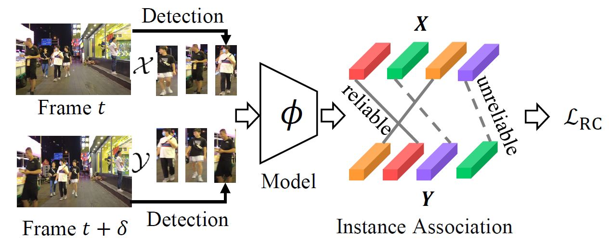
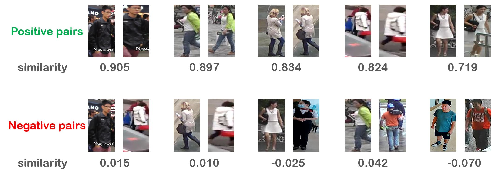
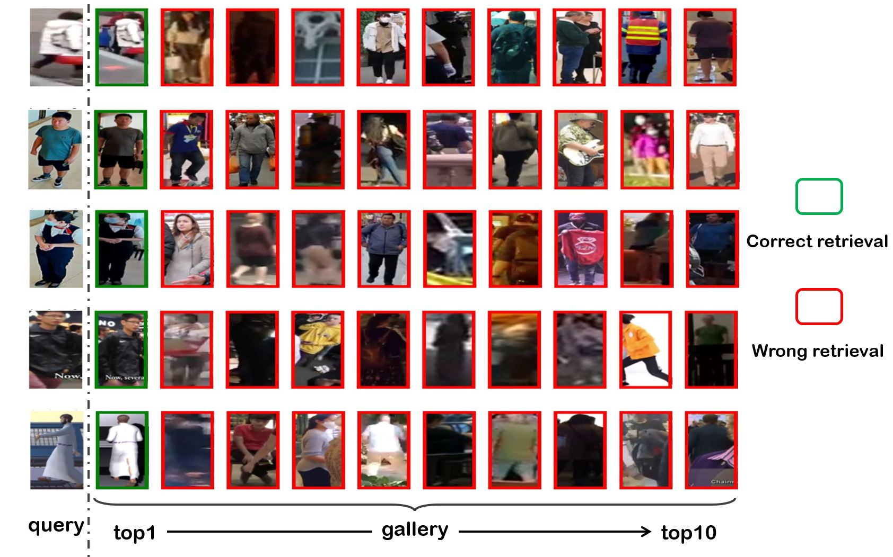
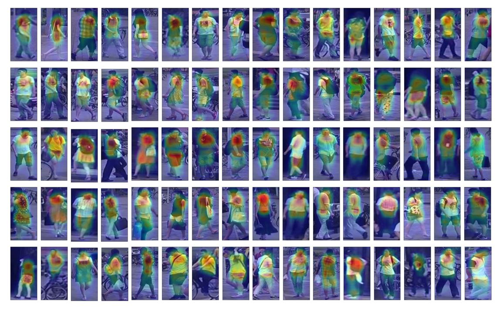

# ISR_ICCV2023_Oral
**[ICCV2023 Oral] Identity-Seeking Self-Supervised Representation Learning for Generalizable Person Re-identification.**

[[ArXiv](https://arxiv.org/pdf/2308.08887.pdf)] [[Demo](https://colab.research.google.com/drive/1MqEJ_O-e753N9NEVkvYcMZmlHlIWgcv6#scrollTo=hPiYsyp-hZbb)][](https://colab.research.google.com/drive/1MqEJ_O-e753N9NEVkvYcMZmlHlIWgcv6#scrollTo=hPiYsyp-hZbb)
<p align="center">  

ISR is a domain-generalizable person ReID model. It is trained with 47.8M person images extracted from 7.4K video clips in an unsupervised manner. ISR can not only be tested directly in unknown domains, but also can quickly adapt to new enviroments, showing good domain generalization and domain adaptation capabilities. Therefore, ISR has a more substantial potential for real-world applications.

## Installation
+ ubuntu 20.04
+ python 3.8.13
+ pytorch 1.8.0
+ torchvision 0.9.0
+ timm 0.4.12

## Model weight
Swin-Transformer---[swin_base_patch4_window7_224.pth](https://cloud.tsinghua.edu.cn/f/facfc952bee74940b106/?dl=1)

## [Demo A] Pedestrian image 1:1 verification
You can input a pair of cropped pedestrian images and the ISR model outputs their similairty score in range -1 to 1, larger scores mean more similar pairs. **Try pedestrian images from diverse domains to see the generalization ability of our model!**

You can run Demo A in our colab. [](https://colab.research.google.com/drive/1MqEJ_O-e753N9NEVkvYcMZmlHlIWgcv6#scrollTo=hPiYsyp-hZbb)

Here, we also provide a command line code for 1:1 verification
```python'''
python demo_A.py --model-weight /path/to/model/weight --image1 /path/to/image1  --image2 /path/to/image2
```
**Examples of 1:1 Verification**
It can be seen that even if the sample pairs come from diverse domains, the similarity between two samples within a positive pair is much larger than the similarity between two samples within a negative pair, which illustrates the generalization of ISR! 

<p align="center">  

## [Demo B] Pedestrian  image 1:(1+N) retrieval
We provide a diverse gallery set with N=2000 random pedestrian images. In this demo, you can upload two images from a same identity (a positive pair). We use one of them as the query, and the other one is mixed into the gallery.  Top-10  gallery samples that the model predicts are most similar to the query will be shown. See if the true possitive one is among the Top-10. **Try pedestrian images from diverse domains to see the generalization ability of our model!**

You can run Demo B in our colab. [](https://colab.research.google.com/drive/1MqEJ_O-e753N9NEVkvYcMZmlHlIWgcv6#scrollTo=hPiYsyp-hZbb)

*   The gallery set:  [[images]](https://cloud.tsinghua.edu.cn/f/458822c607ef460d823b/?dl=1) [[extracted features]](https://cloud.tsinghua.edu.cn/f/49dd2900fc8b42fbae28/?dl=1)

**Examples of 1:(1+N) Verification**
We randomly selected some positive pairs from different domains (including airport lounges, movies, streets, and generated cartoons) and conducted retrieval according to our 1:N+1 experimental setting. As you can see, the retrieval results are very good. You can expand the gallery set and try more positive pairs for wider experiments.

<p align="center">  


## Attention Map
Even without any identity and foreground labels, ISR can foucs on the region of pedestrians! 
<p align="center">  


## Citation
```
@InProceedings{Dou_2023_ICCV,
    author    = {Dou, Zhaopeng and Wang, Zhongdao and Li, Yali and Wang, Shengjin},
    title     = {Identity-Seeking Self-Supervised Representation Learning for Generalizable Person Re-Identification},
    booktitle = {Proceedings of the IEEE/CVF International Conference on Computer Vision (ICCV)},
    month     = {October},
    year      = {2023},
    pages     = {15847-15858}
}
```
